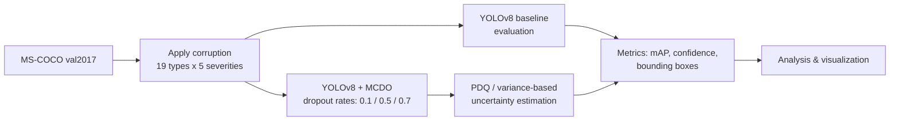
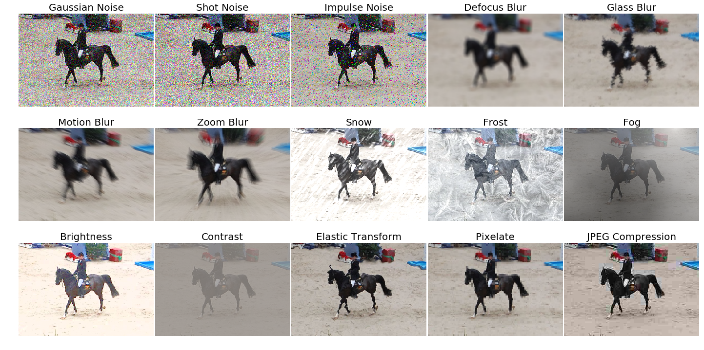

# Image Corruption on Object Detection Data to Evaluate Uncertainty Estimation

Master's thesis project (Universität Heidelberg) evaluating how image corruptions affect YOLOv8 object detection performance, and using Monte Carlo Dropout (MCDO) to estimate the model's uncertainty under those conditions.

## Motivation

Object detection models like YOLOv8 perform well on clean benchmark data, but real-world deployments face corrupted or degraded inputs - sensor noise, motion blur, fog, snow, compression artifacts. This project quantifies how much performance degrades under 19 types of corruption at 5 severity levels, and tests whether Monte Carlo Dropout can give a reliable signal of *when the model is uncertain* - which matters for safety-critical applications like autonomous driving.

## Approach



1. **Corruption generation** - 19 corruption types (noise: Gaussian, shot, impulse, speckle; blur: Gaussian, motion, zoom, glass, defocus; weather: fog, frost, snow; digital: JPEG compression, brightness, contrast, saturate, pixelate, spatter, elastic transform), each at 5 severity levels, applied to the MS-COCO validation set using the [`imagecorruptions`](https://github.com/bethgelab/imagecorruptions) package (Michaelis et al., 2019).
2. **Baseline evaluation** - YOLOv8 evaluated on clean vs. corrupted images, tracking mAP, confidence scores, and bounding box counts.
3. **Monte Carlo Dropout** - dropout layers inserted into YOLOv8's convolutional blocks and kept active at inference time (instead of only during training). Running multiple stochastic forward passes on the same image gives a distribution over predictions; the variance of that distribution is the uncertainty estimate.
4. **Uncertainty quantification** - evaluated at three dropout rates (0.1, 0.5, 0.7) and measured with a variance-based metric and Probabilistic Detection Quality (PDQ).

## Key findings

- **Baseline degradation**: model performance consistently drops as corruption severity increases - e.g. mAP fell from 0.311 to 0.030 and confidence scores from 0.576 to 0.453 under severe contrast corruption; bounding box detections dropped from 20,319 to 1,533.
- **Dropout rate trade-off**:
  - **0.1** - stable predictions, but limited sensitivity as an uncertainty signal.
  - **0.5** - the best balance between maintaining detection performance and producing a useful uncertainty estimate.
  - **0.7** - noticeably reduced detection accuracy at high corruption severities.
- Noise and blur corruptions caused the steepest performance degradation among the 19 types tested.

See `results/plots/` for the full set of charts (model performance by corruption type/severity, confidence score curves, correlation analysis) and `results/data/` for the underlying CSVs.

## Example: corruption types at severity 3



## Repository structure

```
src/
├── model/
│   ├── conv_mcdo.py           # Custom Conv2D block with dropout for MCDO
│   └── custom_yolov8.py       # YOLOv8 wrapper that injects dropout layers
├── training/
│   └── train_mcdo.py          # Training entry point for the MCDO-augmented model
├── inference/
│   ├── mcdo_inference.py      # Multi-sample stochastic inference (MCDO wrapper)
│   └── utils.py                # Image loading / result visualization helpers
├── corruption/
│   ├── apply_corruptions.py            # Apply corruptions across the COCO validation set
│   ├── generate_corrupted_dataset.py   # Build the full corrupted dataset (19 types x 5 severities)
│   ├── zero_severity_baseline.py       # Zero-severity (uncorrupted) baseline generation
│   ├── apply_corruptions_batch.py      # Batch corruption application over a folder
│   └── single_image_corruption_demo.py # Minimal single-image example
├── evaluation/
│   ├── validation_baseline.py      # Baseline YOLOv8 evaluation (no MCDO)
│   ├── validation_mcdo.py          # Evaluation with MCDO enabled
│   ├── validation_snow_corruption.py
│   ├── validation_zero_severity.py
│   ├── validation_custom.py
│   └── pdq_uncertainty_measure.py  # PDQ-based uncertainty metric implementation
└── visualization/
    ├── plot_severities.py       # mAP vs. severity plots
    ├── visualize_metrics.py     # Metric visualization utilities
    └── compute_correlations.py  # Correlation analysis between metrics

results/
├── plots/    # Key result figures
└── data/     # Result CSVs (PDQ variance per dropout rate, confidence scores, correlations)

configs/
├── yolo-mcdo.yaml   # YOLOv8n architecture definition with ConvMCDO layers substituted in
└── coco-mod.yaml     # COCO dataset config used by evaluation scripts
```

## Setup

```bash
pip install -r requirements.txt
```

You'll also need:
- The [MS-COCO val2017](https://cocodataset.org/#download) dataset and annotations
- A YOLOv8 base checkpoint (e.g. `yolov8n.pt`) from [Ultralytics](https://github.com/ultralytics/ultralytics)

Scripts expect a `DATA_DIR` environment variable pointing to your local COCO dataset root (containing `images/val2017/` and `annotations/`):

```bash
export DATA_DIR=/path/to/coco
```

### Running the pipeline

```bash
# 1. Generate the corrupted dataset
python src/corruption/generate_corrupted_dataset.py

# 2. Run baseline evaluation
python src/evaluation/validation_baseline.py

# 3. Train / run the MCDO-augmented model
python src/training/train_mcdo.py

# 4. Evaluate with MCDO uncertainty estimation
python src/evaluation/validation_mcdo.py

# 5. Visualize results
python src/visualization/plot_severities.py
```

> **Note on model weights**: trained model checkpoints (`.pt` files) are not included in this repo due to size - they're excluded via `.gitignore`. Available on request.

## Tech stack

- YOLOv8 (Ultralytics), PyTorch
- [`imagecorruptions`](https://github.com/bethgelab/imagecorruptions) (Michaelis et al.)
- MS-COCO dataset
- NumPy, pandas, matplotlib, seaborn, scikit-learn

## Acknowledgements

Corruption functions built on the [`imagecorruptions`](https://github.com/bethgelab/imagecorruptions) package by Michaelis, Mitzkus, Geirhos, Rusak, Bringmann, Ecker, Bethge & Brendel (2019), itself an extension of Hendrycks & Dietterich's original [corruption benchmark](https://github.com/hendrycks/robustness) (ICLR 2019).

## Author

**Prakriti Jain** - M.Sc. Data and Computer Science, Universität Heidelberg
[LinkedIn](https://www.linkedin.com/in/prakriti-jain-184636161/) · prakriti.ps.jain@gmail.com
